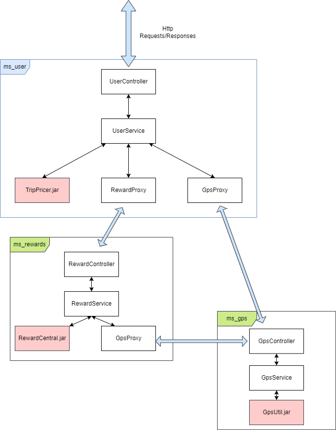

# ms-user

ms_user is the main micro service of TourGuide application.
Tourguide is an application of tourism. With this application,
users can see attractions around them and they can win rewards !
--------------------------------------------------------
###Technologies :
* Java 8
* Gradle
* Spring Boot
* Docker
------------------------
###Architecture
Tourguide uses 3 micro services :
* ms_gps (https://github.com/ChocolateSquirrel/ms-gps/tree/dev)
* ms_rewards (https://github.com/ChocolateSquirrel/ms-rewards/tree/dev)
* ms_user  

--------------------------------
###Deployment with Docker :
* Build the 3 jar (ms_gps, ms_rewards, ms_user)
* Create image for each micro service : ```docker build -t nameOfMicroService``` (nameOfMicroservice must be replaced by ms_user, ms_gps and ms_rewards)
* Deploy application : ```docker-compose up -d```  
To stop the application : ```docker-compose stop``` 
------------
###EndPoints
* GET http://localhost/ : home page of TourGuide application
* GET http://localhost/getLocation (@RequestParam String userName) : return latitude and longitude of the user.
* GET http://localhost/getNearByAttractions (@RequestParam String userName) : return a list (sorted by distance) of the 5 nearest attractions from the user
* GET http://localhost/getNearestAttractions  (@RequestParam String userName) : return a list (sorted by distance) of
5 attractions maximum. These attractions must be at least at 200 miles (ATTRACTION_PROXIMITY_RANGE)
* GET http://localhost/getRewards (@RequestParam String userName) : return rewards of the user
* GET http://localhost/getAllCurrentLocations : return current locations of all users in the same time
* GET http://localhost/getTripDeals (@RequestParam String userName) : return a list of trip deals according to the user preferences
* GET http://localhost/getPreferences (@RequestParam String userName) : return preferences of the user
* PUT http://localhost/update/preferences (@RequestParam String userName, @RequestBody UserPreferencesDTO dto) : update user preferences
